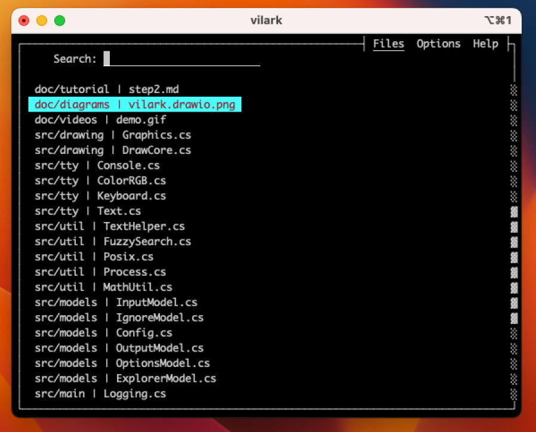

# Vilark

The file selector for humans. 😀

* Works great with Vim, but can also be used from the CLI to launch any $EDITOR.

* Uses C# AOT (100% native code compilation), so startup is lightning fast.

## Installation Instructions

Installing on Linux, Mac, or WSL2 is simple.  The `build.sh` script will automatically
download the .Net 8 SDK to compile Vilark to a single-file executable with
native code (GC, but no JIT).

After building, you can completely remove the .Net SDK to free up space.

    cd /tmp
    git clone --depth 1 https://github.com/kjpgit/vilark
    cd vilark
    ./build.sh

If you have any build errors, please see the
[Microsoft .NET 8 Native Requirements](https://learn.microsoft.com/en-us/dotnet/core/deploying/native-aot/?tabs=net8plus%2Clinux-ubuntu#prerequisites)
, which are basically:

    sudo apt-get install clang zlib1g-dev

## Supported Terminals

A modern terminal emulator (24 bit color, xterm key sequences) is required.  Vilark is tested on:

* [Chrome Secure Shell (aka hterm)](https://chrome.google.com/webstore/detail/secure-shell/iodihamcpbpeioajjeobimgagajmlibd)

* [Windows Terminal (typically used with WSL2)](https://apps.microsoft.com/store/detail/windows-terminal/9N0DX20HK701?hl=en-us&gl=us&rtc=1)

* [iTerm2](https://iterm2.com/)

* Linux console, xterm, lxterminal, gnome-terminal

NOTE: The Google Roboto Mono font is buggy
[(bug)](https://github.com/google/fonts/issues/360)
and is missing certain box drawing
characters and/or they have incorrect widths.

NOTE: Apple's Terminal.App and rxvt do not support 24 bit color codes,
their so usage is not recommended.

## Vim Requirements (For Vim Plugin)

Vim needs to be compiled with `+python3` scripting support.  This is the default
for Ubuntu, as well as Brew on mac.  (Don't use the default `/usr/bin/vim` on Mac)

## Additional Documentation

[Vilark User Guide](doc/README.md)

## About Vilark

Lark (noun) : A source of or quest for amusement or adventure

Skylark (noun) : The male skylark
[sings as it flies](https://www.youtube.com/watch?v=k71j3aW8DMw)

This project is the culmination of 25 years of experience.  I hope it brings you
as much joy as it does me.

© 2023 Karl Pickett / Vilark Project
