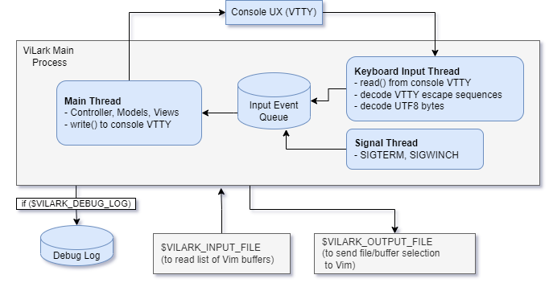

# Developers / Architecture

Thread and process diagram:

Developers who are interested in creating a C# terminal app (including
WSL2/Windows Terminal) might find this project useful as a starting point.

## .Net / C# Annoyances

* Too much UTF-16

* Hard/unsafe to call execve() (overwrite process image).  Seriously, this can't be
  the only CLI launcher program that wants to exec a replacement (and free up
  memory instantly?)

* GetEnvironmentVariables shouldn't need a SO post to explain how to sort it.  It's
  old, non-generic klunkiness.

* Directory class is mostly worthless and not specific enough about directory naming

* Trying to gracefully handle Permission denied exceptions while using an
  iterator (yield return)?  Ugh...

Overall, however, this was a very productive experience, and it should be
extremely maintainable and hackable going forward!

